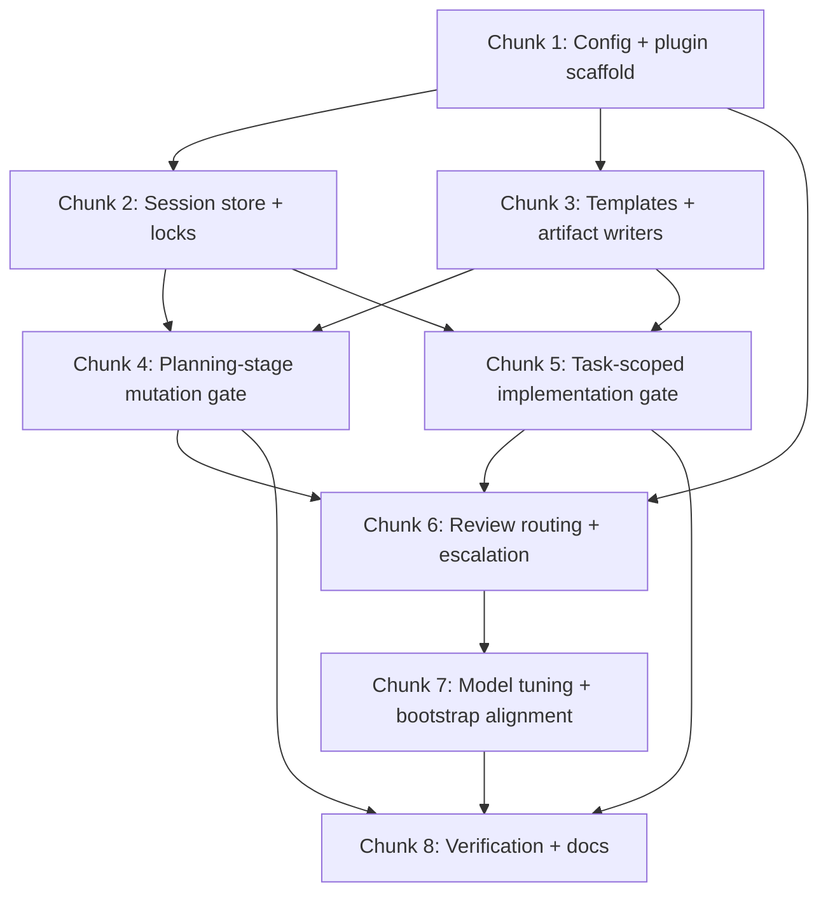

# Planning Files Plugin Implementation Plan

> **For agentic workers:** REQUIRED: Use superpowers:subagent-driven-development (if subagents available) or superpowers:executing-plans to implement this plan. Steps use checkbox (`- [ ]`) syntax for tracking.

**Goal:** Add a plugin-backed planning authority to the local `oh-my-opencode-slim` setup so each engineering session is stored under a project-local planning filesystem, planning-stage writes are hard-gated, execution is DAG-driven, and validation follows `low`/`medium`/`high` review routing.

**Architecture:** Extend the existing local OpenCode setup with a new planning plugin that becomes the single mutation-policy authority for managed runtime actions. Reuse current slim primitives for background sessions, council, model routing, and config merge behavior while storing durable session artifacts under `<git-root>/.agents/artifacts/planning`.

**Tech Stack:** OpenCode plugin API, JavaScript/TypeScript in `~/.config/opencode`, oh-my-opencode-slim config, markdown planning artifacts, local plugin hooks

---

## File Structure

### Files to create

- `plugins/planning-files.js` — main planning plugin entry point and policy gate wiring
- `plugins/planning-files/root-resolution.js` — repo/worktree root detection and path normalization helpers
- `plugins/planning-files/session-store.js` — session directory creation, metadata IO, index updates
- `plugins/planning-files/locks.js` — root lock, session lock, write lease, heartbeat, stale takeover
- `plugins/planning-files/policy.js` — stage gate, task gate, shell argv policy, fail-closed logic
- `plugins/planning-files/task-policy.js` — task packet parsing, allowed path matching, ephemeral outputs
- `plugins/planning-files/review-routing.js` — `low`/`medium`/`high` routing helpers and council/oracle request builders
- `plugins/planning-files/templates/task_plan.md` — session plan template
- `plugins/planning-files/templates/findings.md` — findings template
- `plugins/planning-files/templates/progress.md` — progress template
- `plugins/planning-files/templates/tasks.md` — DAG index template
- `plugins/planning-files/templates/reviews.md` — reviews index template
- `plugins/planning-files/README.md` — local maintenance notes for the planning plugin

### Files to modify

- `opencode.json` — ensure the planning plugin is loaded in the local OpenCode stack
- `<project>/.opencode/oh-my-opencode-slim.jsonc` — canonical project-level planning config required by the approved spec
- `oh-my-opencode-slim.json` — global fallback/defaults only, used when project-local config does not override them
- `plugins/session-tracker.js` — only if needed to expose reusable session metadata to the new planning plugin; avoid touching if current data is sufficient
- `superpowers/.opencode/plugins/superpowers.js` — change only if verification proves plugin runtime alone is insufficient for planning awareness
- `superpowers/docs/specs/2026-04-16-planning-files-plugin-design.md` — only for status line update if desired

### Files to leave unchanged unless forced by implementation proof

- cached installed package files under `~/.cache/opencode/packages/...`
- global `AGENTS.md`
- `skills/task-management/*` except as reference material

---

## Dependency Graph



Parallelizable after Chunk 1:

- Chunk 2 and Chunk 3
- later, parts of Chunk 6 and Chunk 7 once core gate APIs stabilize

---

## Chunk 1: Config and Plugin Scaffold

### Task 1: Add planning plugin to local OpenCode configuration

**Files:**
- Modify: `opencode.json`
- Reference: current `plugin` array in `opencode.json`

- [ ] **Step 1: Insert local planning plugin entry into the plugin load order**

Add a plugin entry that loads `plugins/planning-files.js` before or alongside existing policy-relevant plugins. Preserve existing plugin entries.

- [ ] **Step 2: Keep existing external plugins intact**

Do not remove:
- `opencode-gemini-auth@latest`
- `@rama_nigg/open-cursor@latest`
- `oh-my-opencode-slim`

- [ ] **Step 3: Verify config remains valid JSON**

Run: `node -e 'JSON.parse(require("fs").readFileSync("/Users/8tomat8/.config/opencode/opencode.json","utf8")); console.log("ok")'`
Expected: `ok`

### Task 2: Add planning defaults and model tuning to slim config

**Files:**
- Modify: `<project>/.opencode/oh-my-opencode-slim.jsonc` (canonical project config)
- Modify: `oh-my-opencode-slim.json` (fallback/default config)

- [ ] **Step 1: Add `planning` config block to canonical project config shape**

Add structured canonical settings for:
- `enabled`
- `root` = `.agents/artifacts/planning`
- `heartbeat_interval_ms`
- `stale_after_ms`
- `enforce_stage_gates`
- `readonly_shell_allowlist`
- `task_complexity_routes`
- `review_presets`
- `session_naming`
- `repo_write_lease`

- [ ] **Step 2: Keep global file as fallback only**

Implementation and verification must prove that project-local config wins over global defaults.

- [ ] **Step 3: Update designer model to `google/gemini-3.1-pro-preview`**

Change designer lane to `google/gemini-3.1-pro-preview`.

- [ ] **Step 4: Preserve current orchestrator/oracle/librarian/explorer/fixer lanes unless explicitly changed in spec**

- [ ] **Step 5: Verify config parses**

Run: `node -e 'JSON.parse(require("fs").readFileSync("/Users/8tomat8/.config/opencode/oh-my-opencode-slim.json","utf8")); console.log("ok")'`
Expected: `ok`

### Task 3: Scaffold the planning plugin and helper modules

**Files:**
- Create: `plugins/planning-files.js`
- Create: `plugins/planning-files/root-resolution.js`
- Create: `plugins/planning-files/session-store.js`
- Create: `plugins/planning-files/locks.js`
- Create: `plugins/planning-files/policy.js`
- Create: `plugins/planning-files/task-policy.js`
- Create: `plugins/planning-files/review-routing.js`

- [ ] **Step 1: Create plugin directory tree**

Run: `mkdir -p /Users/8tomat8/.config/opencode/plugins/planning-files/templates`

- [ ] **Step 2: Create `plugins/planning-files.js` with exported plugin shell**

It must:
- receive `{ client, directory }`
- load planning config
- initialize helper modules
- register system hooks/tool interceptors/event handlers in one place

- [ ] **Step 3: Create helper modules with named exports only**

Minimum exported functions:
- root resolution
- session open/resume
- lock/lease acquire-release-heartbeat
- policy evaluation
- task packet parsing
- review route selection

- [ ] **Step 4: Verify plugin files have valid syntax**

Run:
```bash
node --check /Users/8tomat8/.config/opencode/plugins/planning-files.js
find /Users/8tomat8/.config/opencode/plugins/planning-files -name '*.js' -print0 | xargs -0 -n1 node --check
```
Expected: no syntax errors

---

## Chunk 2: Session Store and Locking Core

### Task 4: Implement repo root resolution and normalized path helpers

**Files:**
- Create/Modify: `plugins/planning-files/root-resolution.js`

- [ ] **Step 1: Implement nearest Git root discovery**

Support:
- plain repos
- nested repos/submodules (nearest root wins)
- worktrees (worktree root wins)
- no-git case returns explicit failure unless fallback enabled

- [ ] **Step 2: Implement path normalization helpers**

Helpers must:
- resolve `~`
- resolve symlinks
- normalize case/path separators as platform requires
- compare candidate paths against repo root and task bounds

- [ ] **Step 3: Add focused self-test script block or executable examples in comments**

Include concrete example inputs/expected outputs for:
- nested repo
- worktree
- path traversal attempt

### Task 5: Implement session directory creation and artifact bootstrap

**Files:**
- Create/Modify: `plugins/planning-files/session-store.js`
- Create: `plugins/planning-files/templates/task_plan.md`
- Create: `plugins/planning-files/templates/findings.md`
- Create: `plugins/planning-files/templates/progress.md`
- Create: `plugins/planning-files/templates/tasks.md`
- Create: `plugins/planning-files/templates/reviews.md`

- [ ] **Step 1: Implement unique session id generation**

Format:
- `YYYYMMDDTHHMMSSZ--topic-slug--random6`

- [ ] **Step 2: Implement bootstrap writer for new sessions**

Create:
- planning root if missing
- `sessions/<session-id>/`
- `sessions/<session-id>/tasks/`
- `sessions/<session-id>/reviews/`
- all five base markdown files
- root `index.md` if missing

- [ ] **Step 3: Update `index.md` on session create under the root lock**

Create-time `index.md` update is mandatory and must happen only inside orchestrator-controlled session create flow.

- [ ] **Step 4: Put canonical frontmatter into `task_plan.md`**

Include at least:
- `session_id`
- `repo_root`
- `session_dir`
- `plan_revision`
- `approved_revision`
- `stage`
- `approved_by`
- `approved_at`
- derived `active_tasks`

- [ ] **Step 5: Ensure bootstrapped files contain no implementation-specific guesses**

Use placeholders and explicit headings only.

### Task 6: Implement session lock and repo write lease management

**Files:**
- Create/Modify: `plugins/planning-files/locks.js`

- [ ] **Step 1: Implement root lock and session lock acquisition**

Use atomic create/overwrite-safe behavior only.

Required lock metadata fields:
- session id
- owner id
- process id
- hostname
- start time
- last heartbeat time

- [ ] **Step 2: Implement heartbeat loop for session lock and repo write lease**

Defaults:
- heartbeat 5s
- stale threshold 30s

- [ ] **Step 3: Implement stale takeover sequence exactly**

Sequence:
1. acquire root lock
2. inspect stale candidate
3. verify TTL/process state
4. atomically replace lock/lease ownership
5. append takeover note to `progress.md`
6. release root lock

- [ ] **Step 4: Implement repo write lease file**

Canonical file:
- `.agents/artifacts/planning/repo-write-lease.json`

Required lease metadata fields:
- session id
- owner id
- process id
- hostname
- acquired time
- last heartbeat time

- [ ] **Step 5: Wire lease acquisition into stage transitions**

Encode:
- no transition into `implementing` without successful atomic lease acquisition
- failed acquisition leaves session outside `implementing`
- lease release on completion, explicit stop, or stale takeover

- [ ] **Step 6: Make failure mode fail-closed**

If liveness cannot be proven safely, refuse takeover and surface to user.

### Task 6A: Implement session selection and resume semantics

**Files:**
- Modify: `plugins/planning-files/session-store.js`
- Modify: `plugins/planning-files/locks.js`

- [ ] **Step 1: Implement explicit resume by session id**

- [ ] **Step 2: Force user disambiguation when multiple open sessions exist and none is selected**

- [ ] **Step 3: Implement same-owner resume and read-only behavior for foreign live owners**

- [ ] **Step 4: Encode stale-lock takeover path for resumed sessions**

---

## Chunk 3: Artifact Templates and State Writers

### Task 7: Implement canonical writers for planning artifacts

**Files:**
- Modify: `plugins/planning-files/session-store.js`

- [ ] **Step 1: Add explicit writer functions per artifact type**

Separate writers for:
- `task_plan.md`
- `findings.md`
- `progress.md`
- `tasks.md`
- `reviews.md`
- `reviews/Txxx--rN.md`

- [ ] **Step 2: Enforce canonical ownership rules inside code**

Encode:
- `task_plan.md` = session stage/approval/phases
- `tasks.md` = task state/DAG
- `tasks/Txxx.md` = task instructions and path policy
- `reviews/Txxx--rN.md` = review evidence/verdict
- `reviews.md` = summary only
- `progress.md` = append-only log

- [ ] **Step 3: Add revision binding helpers**

Every task file and review file must carry bound `plan_revision` / `approved_revision` fields.

- [ ] **Step 4: Add canonical writers for `tasks/Txxx.md` files**

Task files are mandatory artifacts, not optional detail.

- [ ] **Step 5: Enforce full required `tasks/Txxx.md` schema from the approved spec**

Every task file must carry:
- plan revision / approved revision binding
- goal
- rationale
- preconditions
- exact allowed paths
- exact forbidden paths
- allowed ephemeral output paths
- allowed shell command forms
- step-by-step instructions
- acceptance criteria
- verification commands with `required_for_acceptance`
- required report format
- escalation rules
- anti-improvisation instruction

### Task 8: Implement crash-safe write strategy

**Files:**
- Modify: `plugins/planning-files/session-store.js`

- [ ] **Step 1: Use write-temp-then-rename for canonical file writes**

Apply to every non-append-only artifact file.

- [ ] **Step 2: Define recovery rebuild path**

On startup/resume, rebuild derived summaries if needed:
- `reviews.md` from review files
- derived `active_tasks` from `tasks.md`

Do **not** rebuild `index.md` during generic startup/resume. Limit `index.md` writes to orchestrator-controlled session create/close flows under the root lock.

- [ ] **Step 3: Never rebuild canonical task or review verdict data from logs**

Logs are informational only.

### Task 8A: Implement state machine and approval semantics

**Files:**
- Modify: `plugins/planning-files/session-store.js`
- Modify: `plugins/planning-files/policy.js`

- [ ] **Step 1: Encode session stages and allowed transitions**

Must cover:
- `planning`
- `awaiting_approval`
- `implementing`
- `validating`
- `quarantined`
- `completed`

- [ ] **Step 2: Encode approval-sensitive edit detection**

Sensitive edits must:
- increment `plan_revision`
- clear approval fields
- move session to `awaiting_approval`

Approval invariant:
- approval is valid only when `approved_revision == plan_revision`
- dispatch and acceptance must reject stale revision bindings

- [ ] **Step 3: Encode quarantine exit and session close gate**

Require explicit orchestrator recovery for quarantine exit and encode full close semantics:
- session `validating` only after all required tasks are resolved for current approved revision
- `completed` only when no task remains in `rework_required`, `blocked`, or unresolved `rejected`
- every implementation task has a recorded review artifact
- final progress summary is written
- `index.md` receives session close entry under root lock

---

## Chunk 4: Planning-Stage Mutation Gate

### Task 9: Implement central policy gate for planning stage

**Files:**
- Modify: `plugins/planning-files/policy.js`
- Modify: `plugins/planning-files.js`

- [ ] **Step 1: Create stage-aware policy evaluator**

It must answer for every action:
- allow / deny
- why
- normalized target paths
- whether quarantine is required on violation

- [ ] **Step 2: Encode planning-stage rules exactly**

Default unknown or future mutating actions to deny.

Allowed:
- orchestrator-only markdown writes in active session dir
- plugin control files (`.root.lock`, active `.session.lock`, `repo-write-lease.json`)
- `index.md` writes only during orchestrator-controlled session create/close under root lock
- `mkdir` only under active session dir or required plugin-control paths
- exact read-only shell/forms from configured allowlist only (`ls`, `find`, `rg`, `grep`, `cat`, `sed -n`, `git status`, `git diff --name-only` by default)

Denied:
- repo code writes
- subagent writes
- implementation-oriented subagent dispatch
- mutating shell
- `rm`
- `lsp_rename`
- `ast_grep_replace`
- rename/delete/replace operations even inside markdown planning scope unless performed by canonical orchestrator artifact writers
- unknown or future read forms outside the configured allowlist

- [ ] **Step 3: Add argv-level shell checker**

Reject:
- redirection
- subshells
- chaining
- `find -exec`
- `xargs`
- `tee`
- mutation-capable pipes

- [ ] **Step 4: Implement quarantine path**

On out-of-bounds mutation attempt:
- abort action if possible
- mark `task_plan.md` stage = `quarantined`
- append contamination note to `progress.md`
- deny further mutation except recovery actions

- [ ] **Step 5: Implement post-action audit hook**

Audit exact allowed path set after each allowed planning-stage mutation and before transition to `awaiting_approval` or `implementing`.

---

## Chunk 5: Task-Scoped Implementation Gate

### Task 10: Implement task packet parsing and allowed-path semantics

**Files:**
- Modify: `plugins/planning-files/task-policy.js`

- [ ] **Step 1: Define exact path semantics**

Support explicitly and document in code:
- exact files
- directory prefixes
- choose one strict policy up front: either no globs at all, or one narrowly-defined glob grammar implemented consistently; do not leave this open-ended
- renames/moves as source+destination checks
- delete permissions as explicit opt-in only

- [ ] **Step 2: Reject ambiguous patterns**

If a task spec contains unparseable or overly broad paths, fail and ask user through orchestrator.

- [ ] **Step 3: Support `allowed_ephemeral_paths` separately from source writes**

Examples:
- `.pytest_cache`
- `coverage/`
- temp build dirs

### Task 11: Enforce implementation-stage task bounds

**Files:**
- Modify: `plugins/planning-files/policy.js`
- Modify: `plugins/planning-files/task-policy.js`

- [ ] **Step 1: Allow mutation only if active task exists and path is inside task policy**

Also explicitly deny:
- all implementation/review-agent writes under `.agents/artifacts/planning/**`
- direct orchestrator writes to non-planning repo files during managed implementation

Subagents must return reports via message payloads only; orchestrator persists accepted summaries into planning artifacts.

- [ ] **Step 2: Apply same normalized-path checks as planning stage**

- [ ] **Step 3: Apply argv-level shell rules to task execution too**

Only allow shell commands/forms declared in task spec.

- [ ] **Step 4: Ensure orchestrator verification reruns inherit active task bounds**

Use:
- `allowed_paths`
- `allowed_ephemeral_paths`
- `required_for_acceptance`

### Task 11A: Implement DAG lifecycle, dependency checks, and stale-work invalidation

**Files:**
- Modify: `plugins/planning-files/session-store.js`
- Modify: `plugins/planning-files/task-policy.js`

- [ ] **Step 1: Encode canonical task lifecycle transitions**

Must cover:
- `draft`
- `ready`
- `dispatched`
- `reported`
- `validating`
- `done`
- `blocked`
- `rework_required`
- `rejected`

- [ ] **Step 2: Enforce dependency checks before dispatch**

- [ ] **Step 3: Enforce safe parallel dispatch checks from task file-domain policy**

- [ ] **Step 4: Invalidate in-flight stale work after approval-sensitive replans**

Abort/ignore stale outputs and rebind replacement tasks to the new revision.

---

## Chunk 6: Review Routing and Escalation

### Task 12: Implement complexity-based review route selection

**Files:**
- Modify: `plugins/planning-files/review-routing.js`

- [ ] **Step 1: Map low/medium/high to review executors**

- `low` -> orchestrator
- `medium` -> council preset `medium-review`
- `high` -> oracle high-review lane

- [ ] **Step 2: Build review packet generator**

Packet must include:
- task spec
- plan references
- subagent report
- changed files
- diff summary
- verification output
- task path rules
- revision binding

- [ ] **Step 3: Enforce orchestrator rerun of every `required_for_acceptance` command before acceptance for low, medium, and high tasks**

### Task 13: Implement mandatory escalation behavior

**Files:**
- Modify: `plugins/planning-files/review-routing.js`
- Modify: `plugins/planning-files/policy.js`

- [ ] **Step 1: Add escalation reasons enum/constants**

At minimum:
- permission_blocked
- unsafe_solution
- ambiguity
- repeated_failure
- loop_detected
- broadening_scope

- [ ] **Step 2: Make non-orchestrator lanes stop and report instead of improvising**

- [ ] **Step 3: Make orchestrator ask user when safe resolution is unavailable inside current plan/permissions**

### Task 14: Implement complexity promotion behavior

**Files:**
- Modify: `plugins/planning-files/review-routing.js`
- Modify: `plugins/planning-files/session-store.js`

- [ ] **Step 1: Support `low -> medium -> high` promotion flow**

- [ ] **Step 2: If promotion changes scope/deps/paths/criteria, clear approval and bump revision**

- [ ] **Step 3: Mark in-flight stale work and refuse acceptance against older revision**

---

## Chunk 7: Bootstrap Alignment and Model Routing

### Task 15: Align superpowers bootstrap with planning mode

**Files:**
- Modify only if needed: `superpowers/.opencode/plugins/superpowers.js`

- [ ] **Step 1: Verify whether planning plugin runtime alone provides sufficient planning awareness**

If yes, leave this file unchanged.

- [ ] **Step 2: If runtime proof shows awareness is still insufficient, inject only a minimal planning-mode reminder**

Hard criterion for change: verification must show the active planning mode is not discoverable enough despite correct runtime enforcement.

### Task 16: Finalize model lane tuning

**Files:**
- Modify: `oh-my-opencode-slim.json`

- [ ] **Step 1: Confirm designer uses `google/gemini-3.1-pro-preview`**

- [ ] **Step 2: Keep oracle strongest reasoning lane**

- [ ] **Step 3: Keep council preset hooks ready for medium review**

If council preset definitions are missing, add minimal structured defaults in config rather than hardcoding inside plugin code.

---

## Chunk 8: Verification and Documentation

### Task 17: Add local maintainer documentation

**Files:**
- Create: `plugins/planning-files/README.md`

- [ ] **Step 1: Document architecture boundaries**

Include:
- what the planning plugin owns
- what slim still owns
- chain of command
- escalation rules

- [ ] **Step 2: Document recovery operations**

Include:
- quarantine recovery
- stale lock recovery
- stale lease recovery
- rebuild of derived files

### Task 18: Verify configs and plugin syntax end-to-end

**Files:**
- Test all created/modified `.js` and `.json` files

- [ ] **Step 1: Syntax-check every planning plugin file**

Run:
```bash
find /Users/8tomat8/.config/opencode/plugins/planning-files -name '*.js' -print0 | xargs -0 -n1 node --check
node --check /Users/8tomat8/.config/opencode/plugins/planning-files.js
```

- [ ] **Step 2: Validate JSON configs**

Run:
```bash
node -e 'JSON.parse(require("fs").readFileSync("/Users/8tomat8/.config/opencode/opencode.json","utf8")); console.log("opencode ok")'
node -e 'JSON.parse(require("fs").readFileSync("/Users/8tomat8/.config/opencode/oh-my-opencode-slim.json","utf8")); console.log("slim ok")'
```

- [ ] **Step 3: Smoke-check planning root bootstrap in a disposable git repo**

Expected outcomes:
- `.agents/artifacts/planning/index.md` created
- session folder created with five base markdown files
- control files created only by plugin/orchestrator path

- [ ] **Step 3A: Smoke-check repo root resolution**

Verify:
- nearest nested repo root wins
- worktree root wins
- path traversal attempts fail normalization checks

- [ ] **Step 3B: Smoke-check resume and lock behavior**

Verify:
- multi-session resume requires user disambiguation
- same-owner resume works
- foreign-owner live session is read-only
- stale session-lock takeover works under root lock
- stale repo-write-lease takeover works under root lock

- [ ] **Step 4: Smoke-check planning-stage write jail**

Verify denied:
- code file write before approval
- mutating shell before approval
- subagent write to planning artifacts
- `rm`, `lsp_rename`, and `ast_grep_replace` during planning

- [ ] **Step 5: Smoke-check implementation-stage task jail**

Verify denied:
- writes outside `allowed_paths`
- undeclared ephemeral outputs
- shell forms outside declared task policy

- [ ] **Step 6: Smoke-check approval reset and stale-work invalidation**

Verify:
- sensitive task-spec change bumps revision
- approval clears
- in-flight work becomes stale and cannot be accepted

- [ ] **Step 7: Smoke-check escalation path**

Force a permission-bounded failure and confirm system asks user rather than improvising.

---

## Execution Notes

- Do **not** edit cached package files under `~/.cache/opencode/packages/...` unless implementation proof shows there is no plugin-based alternative.
- Do **not** use git staging or commits. Leave changes unstaged.
- Prefer implementing the planning plugin as local config/plugin code under `~/.config/opencode`.
- If any task cannot be completed safely within its permissions or bounded file set, escalate to the user through the orchestrator.

## Success Criteria

- [ ] local OpenCode stack loads a planning plugin from `~/.config/opencode`
- [ ] planning session artifacts are created under `<git-root>/.agents/artifacts/planning`
- [ ] planning-stage writes are limited to orchestrator-authored markdown + control files only
- [ ] only one session can hold repo write lease at a time
- [ ] implementation-stage writes are limited to active task policy
- [ ] medium/high review routing is encoded and reachable
- [ ] blocked or ambiguous execution escalates to the user instead of bypassing constraints
- [ ] all config and plugin files parse successfully
