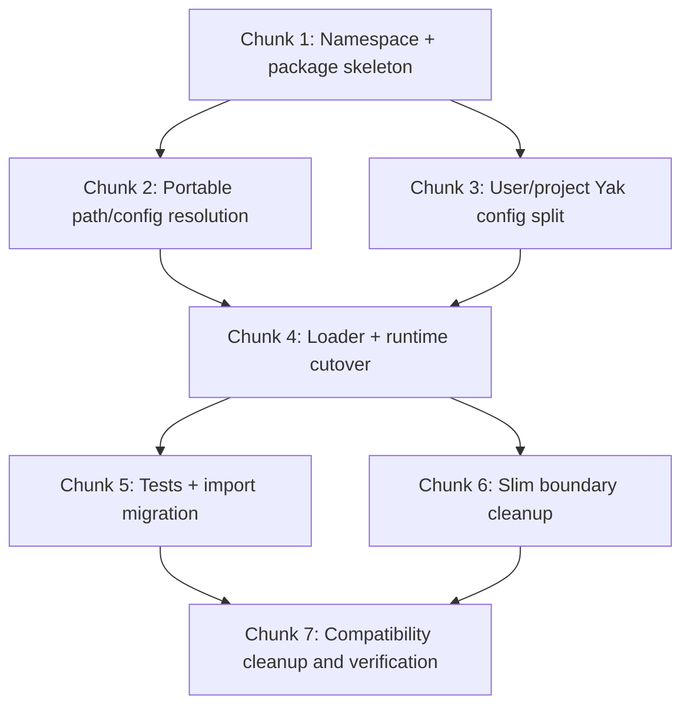

# Yak Local Package Integration Implementation Plan

> **For agentic workers:** REQUIRED: Use the Yak planning runtime as canonical authority for session/task/review state. Old superpowers planning skills are advisory only. Steps use checkbox (`- [ ]`) syntax for tracking.

**Goal:** Turn the current local `yac`/planning-files work into a portable user-level `yak` system that layers cleanly on top of `oh-my-opencode-slim`, with user-level and project-level Yak config and no laptop-specific hardcoded paths.

**Architecture:** Keep `oh-my-opencode-slim` as the model/provider/variant authority and move workflow/runtime ownership into a user-level Yak namespace. Use a thin loader plugin under `~/.config/opencode/plugins/` and place all relocatable Yak logic under `~/.config/opencode/yak/`, with user defaults in `~/.config/opencode/yak.jsonc` and project overrides in `<repo>/.opencode/yak.jsonc`.

**Tech Stack:** OpenCode local plugins, JSON/JSONC config, Node ESM modules, user-level config tree under `~/.config/opencode`, project-local `.opencode` repo config

---

## File Structure

### Files to create

- `yak/README.md` — operator/developer documentation for Yak packaging, config precedence, and portability rules
- `yak.jsonc` — user-level Yak workflow defaults
- `plugins/yak.js` — thin loader entry that resolves the Yak runtime without absolute laptop paths
- `yak/vendor/jsonc-parser.js` — pinned JSONC parser module used by Yak runtime
- `yak/plugins/planning-files.js` — Yak runtime entrypoint (renamed from current Yac host)
- `yak/docs/plans/2026-04-16-yak-local-package-integration.md` — this plan, later moved under final Yak docs path if needed
- `yak/docs/specs/2026-04-16-planning-files-plugin-design.md` — relocated canonical spec if design docs are kept inside Yak docs

### Files to modify

- `opencode.json` — only if unrelated cleanup is needed; Yak activation should rely on plugin auto-discovery rather than plugin-array registration
- `oh-my-opencode-slim.json` — remove Yak workflow config; leave only slim-owned model/provider/variant defaults
- `tests/planning-files/*.test.mjs` — repoint imports and expectations from `yac` to `yak`

### Files to move/rename

- `plugins/yac.js` -> `plugins/yak.js`
- `yac/` -> `yak/`
- `yac/plugins/planning-files/**` -> `yak/plugins/planning-files/**`
- `yac/docs/**` -> `yak/docs/**`

### Files to leave unchanged

- cached installed package files under `~/.cache/opencode/packages/...`
- global `AGENTS.md`
- slim provider auth/secrets except for later env cleanup if required
- superpowers compatibility files for this plan; handle them in a separate follow-up unless Yak bootstrap still depends on them after runtime cutover

---

## Dependency Graph



Parallelizable after Chunk 1:
- Chunk 2 and Chunk 3

---

## Chunk 1: Namespace and Local Package Skeleton

### Task 1: Rename Yac namespace to Yak

**Files:**
- Move: `plugins/yac.js` -> `plugins/yak.js`
- Move: `yac/` -> `yak/`
- Modify: references in tests and docs

- [ ] **Step 1: Rename loader and namespace directories**

Ensure the runtime ends under `~/.config/opencode/yak/` and no active runtime import points to `yac/`.

- [ ] **Step 2: Repoint all local imports to Yak paths**

Update tests, docs, and loader entry to `yak`.

- [ ] **Step 3: Verify no active `yac` references remain in runtime paths**

Run: `grep -R -n '\byac\b\|YacPlugin\|/yac/' /Users/8tomat8/.config/opencode/plugins /Users/8tomat8/.config/opencode/yak /Users/8tomat8/.config/opencode/opencode.json /Users/8tomat8/.config/opencode/yak.jsonc --include='*.js' --include='*.json' --include='*.jsonc' --include='*.mjs'`
Expected: no matches in active runtime/config files.

Allowed temporary legacy artifact during the transition:
- none inside the auto-loaded `plugins/` directory

Removal timing:
- do not keep any duplicate runtime logic under `yac/`

### Task 2: Add local user-level Yak package metadata

**Files:**
- Create: `yak/README.md`

- [ ] **Step 1: Document Yak ownership boundaries in `yak/README.md`**

Cover:
- slim owns models/providers/variants
- Yak owns workflow/runtime
- user config vs project config
- portability rules

Do not add `yak/package.json` in this plan unless the chosen activation contract in Task 7 proves it is actually consumed.

---

## Chunk 2: Portable Path and Config Resolution

### Task 3: Remove laptop-specific absolute paths from Yak runtime

**Files:**
- Modify: `yak/plugins/planning-files.js`
- Reference: path discovery pattern in `superpowers/.opencode/plugins/superpowers.js`

- [ ] **Step 1: Resolve OpenCode config root via `OPENCODE_CONFIG_DIR`, then home/XDG fallback**

Use this exact discovery order:
1. `OPENCODE_CONFIG_DIR`
2. `${XDG_CONFIG_HOME}/opencode`
3. `~/.config/opencode`

- [ ] **Step 2: Resolve Yak asset paths relative to module file, not `'/Users/8tomat8/...`**

- [ ] **Step 3: Resolve user config path as `<config-root>/yak.jsonc`**

- [ ] **Step 4: Keep project config path as `<repo>/.opencode/yak.jsonc`**

- [ ] **Step 5: Verify runtime no longer contains hardcoded home path**

Run: `grep -n '/Users/8tomat8' /Users/8tomat8/.config/opencode/yak/plugins/planning-files.js /Users/8tomat8/.config/opencode/plugins/yak.js`
Expected: no matches

### Task 4: Define strict config precedence in runtime

**Files:**
- Modify: `yak/plugins/planning-files.js`

- [ ] **Step 1: Merge config with this precedence**

1. Yak defaults
2. user `~/.config/opencode/yak.jsonc`
3. project `<repo>/.opencode/yak.jsonc`
4. runtime planning session state

Slim config remains a separate reference source for model/lane information only; it is not part of Yak workflow-config merge.

Merge semantics must be exact:
- scalar values: higher-precedence value replaces lower-precedence value
- objects: deep-merge by key
- arrays: higher-precedence array replaces lower-precedence array entirely
- runtime session state: always authoritative over config defaults

- [ ] **Step 2: Enforce domain split in code**

Yak must not shadow slim-owned fields such as:
- provider choice
- model name
- variant
- fallback/cost policy

Invalid-field behavior must be strict: if `yak.jsonc` contains slim-owned fields, Yak rejects the config with a clear startup/runtime error instead of silently ignoring it.

### Task 4A: Define explicit Yak config schema and backcompat policy

**Files:**
- Create/Modify: `yak/README.md`
- Create: `yak.jsonc`
- Reference/Test: `<repo>/.opencode/yak.jsonc`

- [ ] **Step 1: Define canonical top-level schema for Yak config**

Use a dedicated Yak-owned shape instead of reusing slim's old `planning` block. Example structure:
- `workflow.enabled`
- `workflow.root`
- `workflow.enforce_stage_gates`
- `workflow.heartbeat_interval_ms`
- `workflow.stale_after_ms`
- `workflow.readonly_shell_allowlist`
- `workflow.task_complexity_routes`
- `workflow.review_presets`
- `workflow.session_naming`
- `workflow.repo_write_lease`

Path semantics must be explicit:
- `workflow.root` resolves relative to the target repository root when not absolute
- repo-local path/glob fields in project `yak.jsonc` also resolve relative to the repository root
- user-level config discovery resolves from `OPENCODE_CONFIG_DIR` then home/XDG fallback, but repo-facing workflow paths still resolve relative to the repo root

No-repo behavior must also be explicit:
- if no repo root is available, Yak still loads user-level config
- project `yak.jsonc` is skipped
- repo-relative workflow paths are not resolved yet
- repo-bound planning features stay deferred or disabled until a repo root exists, rather than crashing on startup

Repo-bind flow must be exact:
- Yak may start with no bound repo root
- only implement late repo-binding if OpenCode hook inputs prove a reliable working-directory/session-directory source after startup
- if that proof is missing, Yak falls back to requiring a repo root at session start and keeps no-repo mode as user-config-only / repo-features-disabled
- once a session binds to a repo root, project config and repo-relative workflow paths resolve against that bound root

- [ ] **Step 2: Define transitional backcompat policy explicitly**

Use this exact policy:
- one-release compatibility read from the old slim `planning` block with an explicit warning
- project/user `yak.jsonc` wins over any imported legacy values
- one-release compatibility read from legacy project config locations `.opencode/oh-my-opencode-slim.jsonc` and `.opencode/oh-my-opencode-slim.json` for workflow-only fields with an explicit warning
- legacy import path is removed in the follow-up cleanup release once Yak config is established

Migration behavior must be exact:
- if only legacy slim workflow config exists, Yak imports it once with warning semantics
- if both legacy and Yak config exist, Yak config wins and legacy workflow values are ignored with warning
- existing repo planning/session artifacts remain valid if their schema still matches the active Yak runtime

---

## Chunk 3: User and Project Yak Config Split

### Task 5: Create user-level `yak.jsonc`

**Files:**
- Create: `yak.jsonc`

- [ ] **Step 1: Move workflow defaults out of `oh-my-opencode-slim.json` into `yak.jsonc`**

Default source must be exact:
- Yak has built-in code defaults for a minimal runnable baseline
- `~/.config/opencode/yak.jsonc` is an optional user override layer, not a required file
- if `yak.jsonc` is absent, Yak still boots from built-in defaults plus any legacy one-release import behavior

Fields to own in Yak:
- workflow enable flag
- planning root
- stage-gate enforcement flag
- heartbeat / stale thresholds
- readonly shell allowlist
- task complexity routes
- review presets
- session naming
- repo write lease flag

- [ ] **Step 2: Keep slim config focused on models/variants only**

Do not duplicate workflow knobs in both files.

### Task 6: Add project-level Yak config support

**Files:**
- Reference/Test: `<repo>/.opencode/yak.jsonc`
- Modify: `yak/plugins/planning-files.js`

- [ ] **Step 1: Read project-level `yak.jsonc` if present**

- [ ] **Step 2: Support overriding workflow-only fields**

Examples:
- planning root
- review route tweaks
- repo-specific safety flags

- [ ] **Step 3: Reject slim-owned fields if someone places them in `yak.jsonc`**

This avoids split-brain model config.

---

## Chunk 4: Loader and Runtime Cutover

### Task 7: Make `plugins/yak.js` the only thin runtime loader

**Files:**
- Modify/Create: `plugins/yak.js`
- Modify: `opencode.json`

- [ ] **Step 1: Keep `plugins/yak.js` as a very small shim only**

It should resolve and export Yak runtime without embedding business logic.

- [ ] **Step 2: Decide and implement the exact local-plugin discovery contract**

Use this exact activation contract:
- OpenCode auto-loads `~/.config/opencode/plugins/yak.js`
- no `opencode.json.plugin` registration is required for the local Yak loader
- load order is: global config -> project config -> global plugin dir -> project plugin dir

Treat this as a decision gate, not an assumption:
- first verify the contract with a fresh-start probe
- only then document it as the active contract in `yak/README.md`
- if auto-discovery/load-order proof fails, fall back to the next supported activation path and update this plan before implementation continues

Export contract must also be exact:
- canonical loader: `plugins/yak.js` exports `YakPlugin`
- no second auto-loaded loader file is allowed under `plugins/`

- [ ] **Step 3: Update `opencode.json` only if the proven activation contract requires config registration**

No `opencode.json` plugin-array change is required for Yak activation under this contract. Only update `opencode.json` if unrelated cleanup is needed. Slim remains loaded as base package and Yak layers on top through plugin auto-discovery.

- [ ] **Step 4: Verify loader syntax and plugin config**

Run:
```bash
node --experimental-default-type=module --check /Users/8tomat8/.config/opencode/plugins/yak.js
node -e 'JSON.parse(require("fs").readFileSync("/Users/8tomat8/.config/opencode/opencode.json","utf8")); console.log("opencode ok")'
```

- [ ] **Step 5: Verify real startup activation, not just syntax**

Create one exact startup probe script in Yak, for example `yak/scripts/verify-startup.mjs` or `yak/scripts/verify-startup.sh`, that:
- launches a fresh OpenCode process using the chosen activation contract
- points it at a disposable git repo
- proves Yak startup by checking that planning artifacts are created

The implementation must use that concrete probe in verification instead of an informal manual startup check.

If the probe disproves plugin auto-discovery/load order, stop and update the activation contract before proceeding with the rest of the cutover.

Probe isolation must be strict:
- temp `OPENCODE_CONFIG_DIR` or temp `HOME`/`XDG_CONFIG_HOME`
- temp/disconnected plugin cache state where applicable
- no reuse of existing local package/plugin cache that could mask activation problems

### Task 8: Move design/plan docs under Yak docs path

**Files:**
- Move: current planning design/plan docs into `yak/docs/specs/` and `yak/docs/plans/`

- [ ] **Step 1: Make Yak docs the canonical home for Yak design/plan documents**

- [ ] **Step 2: Remove dependence on `superpowers/docs/...` for Yak-owned docs**

### Task 8B: Migrate user-facing examples and legacy path docs

**Files:**
- Modify: Yak docs/examples/readmes
- Modify: any example config files under `~/.config/opencode` that still mention `yac`, `.opencode/oh-my-opencode-slim.jsonc`, or old planning example names

- [ ] **Step 1: Update user-facing examples from `yac` to `yak`**

- [ ] **Step 2: Update config examples to `.opencode/yak.jsonc` where Yak is now canonical**

- [ ] **Step 3: Remove or replace stale example names such as `planning-files.example.jsonc` once Yak equivalents exist**

### Task 8A: Define rename/backcompat policy for loader entry

**Files:**
- Modify/Create: `plugins/yak.js`

- [ ] **Step 1: Use a flag-day loader rename inside the auto-loaded plugin directory**

Policy:
- `plugins/yak.js` becomes canonical immediately
- `plugins/yac.js` must not remain in the auto-loaded plugin directory because double plugin startup is too risky
- if a temporary compatibility note is needed, keep it in docs only, not as a second auto-loaded loader file

- [ ] **Step 2: Do not keep long-lived duplicate runtime logic under both names**

---

## Chunk 5: Tests and Import Migration

### Task 9: Repoint tests from Yac to Yak

**Files:**
- Modify: `tests/planning-files/*.test.mjs`

- [ ] **Step 1: Update imports to `../../yak/...` and `../../plugins/yak.js`**

- [ ] **Step 2: Update any namespace-specific expectations from `yac` to `yak`**

### Task 10: Add portability tests

**Files:**
- Modify: `tests/planning-files/planning-files-plugin.test.mjs`

- [ ] **Step 1: Add test for user-level `yak.jsonc` override**

- [ ] **Step 2: Add test proving project `yak.jsonc` overrides user-level workflow defaults**

- [ ] **Step 3: Add test proving slim-owned model fields are not taken from `yak.jsonc`**

- [ ] **Step 4: Add test proving slim-owned fields in `yak.jsonc` fail loudly**

- [ ] **Step 5: Add test proving one-release legacy import from slim `planning` block still works with warning when `yak.jsonc` is absent**

- [ ] **Step 5A: Add test proving `yak.jsonc` wins when both legacy workflow config and Yak config exist, and that legacy import emits warning**

- [ ] **Step 6: Add tests for robust JSONC parsing of `yak.jsonc`**

Cover at minimum:
- line comments
- block comments
- trailing commas
- invalid JSONC failure path with clear error

Implementation requirement:
- replace the current regex-based JSONC stripping with the pinned parser module at `yak/vendor/jsonc-parser.js`
- do not rely on regex cleanup as the long-term parser

- [ ] **Step 6A: Record vendored parser provenance**

In `yak/README.md` or a dedicated vendor note, record:
- upstream project/source URL
- pinned version/commit
- license
- integrity/update note for `yak/vendor/jsonc-parser.js`

- [ ] **Step 7: Add direct tests for full merge contract from Task 4**

Cover at minimum:
- scalar replacement
- object deep-merge
- array replacement
- runtime session-state precedence over config defaults

- [ ] **Step 8: Add test for no-repo startup behavior**

Verify user-level config still loads and repo-bound workflow features defer cleanly without crashing.

- [ ] **Step 9: Add test for config-root precedence**

Verify exact discovery order:
1. `OPENCODE_CONFIG_DIR`
2. `${XDG_CONFIG_HOME}/opencode`
3. `~/.config/opencode`

---

## Chunk 6: Slim Boundary Cleanup

### Task 11: Remove Yak workflow knobs from slim config

**Files:**
- Modify: `oh-my-opencode-slim.json`

- [ ] **Step 1: Remove `planning` block from slim config after Yak config is live**

Only after backcompat policy from Task 4A is implemented or intentionally declined.

- [ ] **Step 2: Leave designer/orchestrator/oracle/etc. model preferences in slim config**

- [ ] **Step 3: Verify slim config still parses**

Run: `node -e 'JSON.parse(require("fs").readFileSync("/Users/8tomat8/.config/opencode/oh-my-opencode-slim.json","utf8")); console.log("slim ok")'`

### Task 12: Leave superpowers compatibility cleanup for a follow-up plan

**Files:**
- No changes in this plan unless Yak bootstrap implementation proves a hard dependency remains

- [ ] **Step 1: Verify Yak can start and run without further superpowers planning changes**

- [ ] **Step 2: If hard dependency remains, record it as explicit follow-up work rather than silently expanding this plan**

---

## Chunk 7: Final Verification

### Task 13: Verify runtime, config, and tests end-to-end

**Files:**
- Verify all Yak runtime and test files

- [ ] **Step 1: Syntax-check all Yak runtime files**

Run:
```bash
node --experimental-default-type=module --check /Users/8tomat8/.config/opencode/plugins/yak.js
node --experimental-default-type=module --check /Users/8tomat8/.config/opencode/yak/plugins/planning-files.js
find /Users/8tomat8/.config/opencode/yak/plugins/planning-files -name '*.js' -print0 | xargs -0 -n1 node --experimental-default-type=module --check
```

- [ ] **Step 2: Run the planning-files test suite**

Run: `node --experimental-default-type=module --test /Users/8tomat8/.config/opencode/tests/planning-files/*.test.mjs`
Expected: all pass

- [ ] **Step 3: Verify there are no absolute home-path hardcodes in active Yak runtime**

Run: `grep -R -n '/Users/8tomat8' /Users/8tomat8/.config/opencode/plugins/yak.js /Users/8tomat8/.config/opencode/yak/plugins /Users/8tomat8/.config/opencode/yak/scripts --include='*.js' --include='*.json' --include='*.jsonc'`
Expected: no matches in active runtime files. Docs/examples/tests are excluded from this check.

- [ ] **Step 4: Smoke-test with a disposable git repo**

Verify:
- user-level `yak.jsonc` loads
- project-level `.opencode/yak.jsonc` overrides workflow defaults
- planning root bootstrap still works
- planning-stage gating still works
- implementation-stage task path gating still works

- [ ] **Step 5: Run the fresh-start startup probe in an isolated config environment**

The startup probe from Task 7 must run with a temporary `OPENCODE_CONFIG_DIR` or temporary `HOME`/`XDG_CONFIG_HOME` so hidden local config/cache dependencies cannot fake success.

---

## Success Criteria

- [ ] Yak runtime is isolated under `~/.config/opencode/yak/`
- [ ] loader is isolated under `~/.config/opencode/plugins/yak.js`
- [ ] user-level workflow config exists at `~/.config/opencode/yak.jsonc`
- [ ] project-level workflow config exists at `<repo>/.opencode/yak.jsonc`
- [ ] slim remains model/provider/variant authority only
- [ ] active Yak runtime contains no laptop-specific absolute paths
- [ ] tests pass after namespace/config cutover
- [ ] future publish path is packaging, not rewrite
