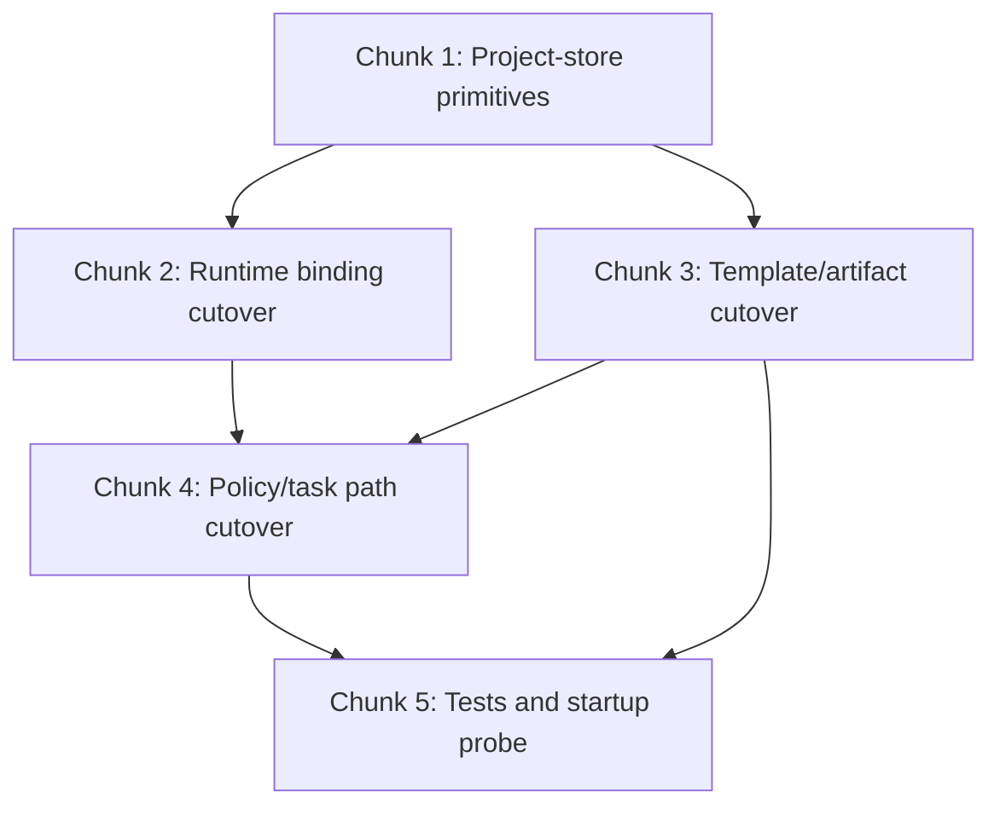

# Yak Project Folder Cutover Implementation Plan

> **For agentic workers:** REQUIRED: Use Yak planning runtime as canonical authority. Steps use checkbox (`- [ ]`) syntax for tracking.

**Goal:** Replace Yak's session-identified planning storage with a simpler project-folder model under `.agents/yak/projects/<project-slug>/`, so permissions and recovery derive from project/task state instead of OpenCode session identity.

**Architecture:** Hard-cut the storage model from `sessions/<id>` + `session-index.json` to persistent project folders. Runtime keeps only an in-memory `active_project_slug` per OpenCode session, auto-binds to the single known project when safe, and otherwise asks the orchestrator/user to choose or create a project. Project files become the sole durable planning memory.

**Tech Stack:** OpenCode local plugin hooks, Node ESM modules, Markdown project artifacts, Yak runtime tests under `tests/planning-files`

---

## File Structure

### Files to create

- `yak/plugins/planning-files/templates/project.md` — canonical project summary/state template
- `yak/plugins/planning-files/templates/context.md` — durable facts/tools/constraints template
- `yak/plugins/planning-files/templates/backlog.md` — open/later/blocked/dropped items template

### Files to modify

- `yak/plugins/planning-files.js` — replace session bootstrap/lookup with project binding logic
- `yak/plugins/planning-files/session-store.js` — replace session-dir/session-index helpers with project-dir helpers
- `yak/plugins/planning-files/policy.js` — use project-dir authority instead of session-dir authority where needed
- `yak/plugins/planning-files/task-policy.js` — keep task-scoped behavior, but link task files under project folders
- `yak/plugins/planning-files/templates/findings.md` — project-scoped findings template
- `yak/plugins/planning-files/templates/progress.md` — project-scoped progress template
- `yak/plugins/planning-files/templates/reviews.md` — project-scoped reviews template
- `yak/plugins/planning-files/templates/tasks.md` — project-scoped DAG index template
- `yak/README.md` — update active storage model and project behavior docs
- `tests/planning-files/yak-plugin.test.mjs` — replace session-folder expectations with project-folder expectations
- `tests/planning-files/session-store.test.mjs` — replace session-index/session-dir assumptions with project-store helpers
- `tests/planning-files/policy.test.mjs` — update planning write expectations from session dir to project dir if needed
- `yak/scripts/verify-startup.mjs` — verify project folder bootstrap instead of session folder bootstrap

### Files to delete or stop using

- `session-index.json` runtime dependency
- `sessions/<id>/` runtime dependency
- `.session.lock` dependency tied to planning identity

---

## Dependency Graph

---

## Chunk 1: Project-Store Primitives

### Task 1: Replace session-store primitives with project-store primitives

**Files:**
- Modify: `yak/plugins/planning-files/session-store.js`

- [ ] **Step 1: Add project-root helpers**

Implement helpers for:
- `getProjectsRoot(repoRoot)` -> `.agents/yak/projects`
- `getProjectDir(repoRoot, projectSlug)`
- `listProjects(repoRoot)`
- `projectExists(repoRoot, projectSlug)`
- `ensureProjectArtifacts(...)`

- [ ] **Step 2: Remove session-index dependency from active runtime helpers**

Keep only what is still needed for reading/writing markdown artifacts.

- [ ] **Step 3: Replace `task_plan.md` authority with `project.md` authority**

Add helpers equivalent to:
- `getProjectFilePath(projectDir, 'project.md')`
- `readProjectState(projectDir)`
- `setProjectStage(projectDir, stage)`

- [ ] **Step 4: Keep task/review file writers but relocate them under project dir**

New task path basis:
- `.agents/yak/projects/<project-slug>/tasks/Txxx.md`

### Task 2: Define default first-project behavior

**Files:**
- Modify: `yak/plugins/planning-files/session-store.js`

- [ ] **Step 1: Choose default first-project slug from repo basename**

If no projects exist, create first project as:
- sanitized `path.basename(repoRoot)`

- [ ] **Step 2: Document that user can later create/switch named projects explicitly**

No hidden migration from old sessions.

---

## Chunk 2: Runtime Binding Cutover

### Task 3: Replace runtime session mapping with active-project binding

**Files:**
- Modify: `yak/plugins/planning-files.js`

- [ ] **Step 1: Remove planning identity based on `planning_session_id` and `session_dir`**

Replace with runtime state like:
- `active_project_slug`
- `project_dir`

- [ ] **Step 2: Bind project at runtime start**

Rules:
- if zero projects -> create first default project
- if one project -> bind automatically
- if multiple projects and no explicit active project -> refuse mutation and surface clear selection-needed error

- [ ] **Step 3: Keep child sessions inheriting parent active project slug only**

No project duplication, no new planning identity.

### Task 4: Replace session lifecycle hooks with project-state hooks

**Files:**
- Modify: `yak/plugins/planning-files.js`

- [ ] **Step 1: `session.created` should bind project, not create planning session folder**

- [ ] **Step 2: `session.deleted` should not close/delete project state just because chat session ends**

Project folders persist across conversations.

- [ ] **Step 3: Only append durable progress/review/project updates based on actual task state, not session disposal**

---

## Chunk 3: Template and Artifact Cutover

### Task 5: Replace session templates with project templates

**Files:**
- Create: `yak/plugins/planning-files/templates/project.md`
- Create: `yak/plugins/planning-files/templates/context.md`
- Create: `yak/plugins/planning-files/templates/backlog.md`
- Modify: existing templates under `yak/plugins/planning-files/templates/`

- [ ] **Step 1: `project.md` must hold canonical project state**

Include:
- project slug
- name/title
- goal
- scope
- current status/stage
- active task ref
- blockers
- major decisions

- [ ] **Step 2: `context.md` must hold durable facts**

Include:
- assumptions
- constraints
- useful tools/resources
- durable discoveries

- [ ] **Step 3: `backlog.md` must hold now/later/blocked/dropped**

- [ ] **Step 4: Update findings/progress/reviews/tasks templates to project-scoped language**

Remove session-id/session-dir wording.

---

## Chunk 4: Policy and Task Cutover

### Task 6: Replace planning write authority from session dir to project dir

**Files:**
- Modify: `yak/plugins/planning-files/policy.js`
- Modify: `yak/plugins/planning-files.js`

- [ ] **Step 1: Planning-stage markdown writes should be limited to active project dir**

New allowed root:
- `.agents/yak/projects/<project-slug>/`

- [ ] **Step 2: Remove old assumptions about session-local planning dir**

- [ ] **Step 3: Keep task-scoped implementation writes unchanged except for new task file locations**

### Task 7: Keep active task model but relocate under project

**Files:**
- Modify: `yak/plugins/planning-files.js`
- Modify: `yak/plugins/planning-files/task-policy.js`

- [ ] **Step 1: `active_task_id` now resolves inside active project folder**

- [ ] **Step 2: If multiple projects exist and no active project chosen, task writes must not proceed**

---

## Chunk 5: Tests and Startup Probe

### Task 8: Rewrite tests for project-folder model

**Files:**
- Modify: `tests/planning-files/yak-plugin.test.mjs`
- Modify: `tests/planning-files/session-store.test.mjs`
- Modify: `tests/planning-files/policy.test.mjs` if needed

- [ ] **Step 1: Replace session-folder expectations**

Expect:
- `.agents/yak/projects/<slug>/...`
- no `session-index.json`
- no `sessions/<id>/`

- [ ] **Step 2: Add tests for binding rules**

Cover:
- zero projects -> create default project
- one project -> auto-bind
- multiple projects -> selection-needed error for mutation path
- child session inherits parent active project slug

- [ ] **Step 3: Add recovery-style test**

New plugin instance + existing project folder should still allow auto-bind when only one project exists.

### Task 9: Update startup probe

**Files:**
- Modify: `yak/scripts/verify-startup.mjs`

- [ ] **Step 1: Verify startup creates project folder, not session folder**

Expected:
- `.agents/yak/projects/<default-slug>/project.md`

- [ ] **Step 2: Verify startup probe passes in clean isolated config env**

---

## Success Criteria

- [ ] Yak no longer uses `session-index.json` or `sessions/<id>/` as active planning identity
- [ ] Yak stores planning state under `.agents/yak/projects/<project-slug>/`
- [ ] Recovered/new sessions can continue when only one project exists
- [ ] Child sessions inherit active project without project duplication
- [ ] Multiple projects force explicit selection instead of silent guessing
- [ ] Planning/task permissions derive from project/task state, not session identity
- [ ] full planning-files test suite passes
